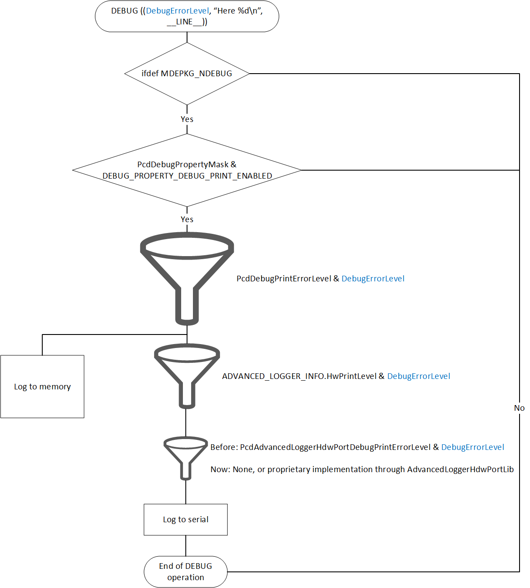

# AdvLoggerPkg - Advanced Logger Package

## About

The AdvancedLogger logs all debug messages into memory.
At certain points, the log may be flushed to disk.
The in memory log data is also available during runtime.

## Configuration

The following configurations are supported:

| Phase    | Usage |
| ---      | --- |
| DXE Only | Uses DxeCore, DxeRuntime, and Dxe AdvancedLoggerLib libraries for logging from start of DXE CORE through Exit Boot Services.  Accepts the PEI Advanced Logger Hob if one is generated.  Produces the AdvancedLogger protocol. |
| DXE+SMM  | Requires DXE modules above, and adds the Smm AdvancedLoggerLib library.  Collects SMM generated messages in the in memory log. |
| PEI      | Uses PeiCore and Pei AdvancedLoggerLib libraries.  Creates the Advanced Logger Hob if PcdAdvancedLoggerPeiInRAM is set. |
| SEC      | Uses the Sec Advanced Logger Library. SEC requires a fixed load address, so it piggy backs on the Temporary RAM PCD information.  Produces a Fixed Address temporary RAM log.  When memory is added, the Sec Advanced Logger library converts the Temporary RAM logging information to the PEI Advanced Logger Hob. |
| PEI64    | Uses Pei64 Advanced Logger Library. Requires the SEC fixed address temporary log information in order to log Pei64 bit DEBUG messages. |
| MM       | Standalone MM - Loads during PEI phase. |
| MMARM    | Standalone MM that loads prior to UEFI with a fixed memory block shared with UEFI. |

PCD's used by Advanced Logger

| PCD                                     | Function of the PCD|
| ---                                     | --- |
|PcdAdvancedLoggerForceEnable             | The default operation is to check if a Logs directory is present in the root of the filesystem.  If the UefiLogs directory is present, logging is enabled. When PcdAdvancedLoggerForceEnable is TRUE, and the device is not a USB device, a UefiLogs directory will be created and logging is enabled.  When logging is enabled, the proper log files will be created if not already preset.|
|PcdAdvancedLoggerPeiInRAM                | For systems that have memory at PeiCore entry. The full in memory log buffer if PcdAdvancedLoggerPages is allocated in the Pei Core constructor and PcdAdvancedLoggerPreMemPages is ignored.|
|PcdAdvancedLoggerFixedInRAM              | For systems that have a fixed memory buffer prior to UEFI. The full in memory log buffer is assumed.|
|PcdAdvancedHdwLoggerDebugPrintErrorLevel | The standard debug flags filter which log messages are produced.  This PCD allow a subset of log messages to be forwarded to the Hdw Port Lib.|
|PcdAdvancedHdwLoggerDisable              | Specifies when to disable writing to the Hdw Port.|
|PcdAdvancedLoggerPreMemPages             | Amount of temporary RAM used for the debug log.|
|PcdAdvancedLoggerPages                   | Amount of system RAM used for the debug log|
|PcdAdvancedLoggerLocator                 | When enabled, the AdvLogger creates a variable "AdvLoggerLocator" with the address of the LoggerInfo buffer|

## Libraries

The following libraries are used with AdvancedLogger:

| Library                    | Function of the Library |
| ---                        | --- |
| AdvancedLoggerAccessLib    | Used to access the memory log - used by FileLogger and Serial/Dxe/Logger |
| AdvancedLoggerLib          | One per module type - used to provide access to the in memory log buffer |
| AdvLoggerSmmAccessLib      | Used to intercept GetVariable in order to provide an OS utility the ability to read the log |
| BaseDebugLibAdvancedLogger | Basic Dxe etc DebugLib |
| BasePanicLibAdvancedLogger | Basic PanicLib that applies to all PI boot phases that AdvancedLoggerLib supports. |
| DebugAgent                 | Used to intercept SEC initialization |
| PeiDebugLibAdvancedLogger  | Basic Pei DebugLib |
| AdvancedLoggerHdwPortLib   | Hook for a hardware port to capture debug messages as they are written to the log. |

## Platform notes

### IA32/X64

The SEC version of the Advanced Logger uses the temporary RAM block. This block is fixed in size
and location, and this temporary RAM block needs to be adjusted to make room for the Advanced
Logger buffer.
There may be cases where the processor cache size is too small to enable the Advanced Logger
during SEC.

The PEI versions of Advanced Logger work together to save space.  Rather than have the Debug Print
libraries linked in all the PEIM's, only PEI_CORE has the Debug Print libraries.
The PEI version of AdvancedLoggerLib uses the IDT to access a pointer to the PEI_CORE routines.

The following changes are needed in the .dsc for IA32/X64.

```inf
[LibraryClasses.common]
  DebugLib|AdvLoggerPkg/Library/BaseDebugLibAdvancedLogger/BaseDebugLibAdvancedLogger.inf
  AdvancedLoggerHdwPortLib|AdvLoggerPkg/Library/AdvancedLoggerHdwPortLib/AdvancedLoggerHdwPortLib.inf

[LibraryClasses.IA32.SEC]
  AdvancedLoggerLib|AdvLoggerPkg/Library/AdvancedLoggerLib/Sec/AdvancedLoggerLib.inf
  DebugAgentLib|AdvLoggerPkg/Library/DebugAgent/Sec/AdvancedLoggerSecDebugAgent.inf

[LibraryClasses.IA32.PEI_CORE]
  AdvancedLoggerLib|AdvLoggerPkg/Library/AdvancedLoggerLib/PeiCore/AdvancedLoggerLib.inf

[LibraryClasses.IA32.PEIM]
  DebugLib|AdvLoggerPkg/Library/PeiDebugLibAdvancedLogger/PeiDebugLibAdvancedLogger.inf

[LibraryClasses.X64.PEIM]
  AdvancedLoggerLib|AdvLoggerPkg/Library/AdvancedLoggerLib/Pei64/AdvancedLoggerLib.inf

[LibraryClasses.X64]
  AdvancedLoggerLib|AdvLoggerPkg/Library/AdvancedLoggerLib/Dxe/AdvancedLoggerLib.inf
  AdvancedLoggerAccessLib|AdvLoggerPkg/Library/AdvancedLoggerAccessLib/AdvancedLoggerAccessLib.inf

[LibraryClasses.X64.DXE_CORE]
  AdvancedLoggerLib|AdvLoggerPkg/Library/AdvancedLoggerLib/DxeCore/AdvancedLoggerLib.inf

[LibraryClasses.X64.DXE_SMM_DRIVER]
  AdvancedLoggerLib|AdvLoggerPkg/Library/AdvancedLoggerLib/Smm/AdvancedLoggerLib.inf

[LibraryClasses.X64.SMM_CORE]
  AdvancedLoggerLib|AdvLoggerPkg/Library/AdvancedLoggerLib/Smm/AdvancedLoggerLib.inf

[LibraryClasses.X64.DXE_RUNTIME_DRIVER]
  AdvancedLoggerLib|AdvLoggerPkg/Library/AdvancedLoggerLib/Runtime/AdvancedLoggerLib.inf

[PcdsFeatureFlag]
## Build Example if your build environment differentiates customer builds from internal test builds
!if $(SHIP_MODE) == FALSE
  gAdvLoggerPkgTokenSpaceGuid.PcdAdvancedFileLoggerForceEnable|TRUE
  gAdvLoggerPkgTokenSpaceGuid.PcdAdvancedFileLoggerLocator|TRUE
!else
  gAdvLoggerPkgTokenSpaceGuid.PcdAdvancedFileLoggerForceEnable|FALSE
  gAdvLoggerPkgTokenSpaceGuid.PcdAdvancedFileLoggerLocator|TRUE
!endif
```

The following changes should be in the family .dsc where the processor specific changes are specified

```inf
[PcdsFixedAtBuild.common]
  gAdvLoggerPkgTokenSpaceGuid.PcdAdvancedLoggerPreMemPages|24

  #Advanced Logger configuration
  gAdvLoggerPkgTokenSpaceGuid.PcdAdvancedLoggerBase         | 0xFA000000 # Must be TemporaryRamBase
  gAdvLoggerPkgTokenSpaceGuid.PcdAdvancedLoggerCarBase      | 0xFA200000 # Address for CAR memory
  gAdvLoggerPkgTokenSpaceGuid.PcdAdvancedLoggerPreMemPages  | 256        # Size is 1MB
  gAdvLoggerPkgTokenSpaceGuid.PcdAdvancedLoggerPages        | 1024       # Size is 4MB

```

### ARM with Security Processor

#### UEFI

In this configuration, the Advanced Logger memory buffer is preallocated and setup from the BL31
(secure partition loader) at a known address.
This simplifies SEC and PEI as memory has already been configured.

Due to the memory block being at a known address, the SEC, PEI_CORE, and PEI modules link to
the BaseArm version of AdvancedLoggerLib.
While the BaseArm version includes the Debug Print libraries, it is assumed that there are few
PEI components in the ARM with Security Processor configuration.

```inf
################################################################
#
# Advanced Logger Configurations
#
################################################################
[LibraryClasses.common]
  DebugLib|AdvLoggerPkg/Library/BaseDebugLibAdvancedLogger/BaseDebugLibAdvancedLogger.inf
  AssertLib|AdvLoggerPkg/Library/AssertLib/AssertLib.inf
  AdvancedLoggerHdwPortLib|AdvLoggerPkg/Library/AdvancedLoggerHdwPortLib/AdvancedLoggerHdwPortLib.inf
  AdvancedLoggerAccessLib|AdvLoggerPkg/Library/AdvancedLoggerAccessLib/AdvancedLoggerAccessLib.inf

[LibraryClasses.common.SEC]
  AdvancedLoggerLib|AdvLoggerPkg/Library/AdvancedLoggerLib/BaseArm/AdvancedLoggerLib.inf
  AssertLib|AdvLoggerPkg/Library/AssertLib/AssertLib.inf

[LibraryClasses.common.PEI_CORE]
  AdvancedLoggerLib|AdvLoggerPkg/Library/AdvancedLoggerLib/PeiCore/AdvancedLoggerLib.inf

[LibraryClasses.common.PEIM]
  AdvancedLoggerLib|AdvLoggerPkg/Library/AdvancedLoggerLib/Pei/AdvancedLoggerLib.inf
  DebugLib|AdvLoggerPkg/Library/PeiDebugLibAdvancedLogger/PeiDebugLibAdvancedLogger.inf

[LibraryClasses.common.DXE_DRIVER, LibraryClasses.common.UEFI_DRIVER, LibraryClasses.common.UEFI_APPLICATION]
  AdvancedLoggerLib|AdvLoggerPkg/Library/AdvancedLoggerLib/Dxe/AdvancedLoggerLib.inf

[LibraryClasses.common.DXE_CORE]
  AdvancedLoggerLib|AdvLoggerPkg/Library/AdvancedLoggerLib/DxeCore/AdvancedLoggerLib.inf

[LibraryClasses.common.DXE_RUNTIME_DRIVER]
  AdvancedLoggerLib|AdvLoggerPkg/Library/AdvancedLoggerLib/Runtime/AdvancedLoggerLib.inf

[PcdsFeatureFlag]
  gAdvLoggerPkgTokenSpaceGuid.PcdAdvancedFileLoggerForceEnable|FALSE
  gAdvLoggerPkgTokenSpaceGuid.PcdAdvancedLoggerLocator|TRUE
  gAdvLoggerPkgTokenSpaceGuid.PcdAdvancedLoggerFixedInRAM|TRUE

  # Set AdvLogger to flush at ReadyToBoot (0x01) and at ExitBootServices (0x02).
  gAdvLoggerPkgTokenSpaceGuid.PcdAdvancedFileLoggerFlush|0x03
```

The following changes should be in the family .dsc where the processor specific changes are specified

```inf
[PcdsFixedAtBuild.common]
  #Advanced Logger configuration
  gAdvLoggerPkgTokenSpaceGuid.PcdAdvancedLoggerBase   | 0xFF622000 # Buffer address
  gAdvLoggerPkgTokenSpaceGuid.PcdAdvancedLoggerPages  | 0x400      # Size is 4MB
```

#### MM Standalone Arm with security processor

In this configuration, the MM code needs to initialize the common buffer that was allocated from
the BL31 (secure partition loader) in order to provide log messages prior to UEFI starting.

```inf
[LibraryClasses.common]
  DebugLib|AdvLoggerPkg/Library/BaseDebugLibAdvancedLogger/BaseDebugLibAdvancedLogger.inf
  AssertLib|AdvLoggerPkg/Library/AssertLib/AssertLib.inf
  AdvancedLoggerHdwPortLib|AdvLoggerPkg/Library/AdvancedLoggerHdwPortLib/AdvancedLoggerHdwPortLib.inf

[LibraryClasses.common.MM_CORE_STANDALONE]
  AdvancedLoggerLib|AdvLoggerPkg/Library/AdvancedLoggerLib/MmCoreArm/AdvancedLoggerLib.inf

[LibraryClasses.common.MM_STANDALONE]
  AdvancedLoggerLib|AdvLoggerPkg/Library/AdvancedLoggerLib/BaseArm/AdvancedLoggerLib.inf
  AdvLoggerAccessLib|AdvLoggerPkg/Library/AdvLoggerMmAccessLib/AdvLoggerMmAccessLib.inf

[PcdsFeatureFlag]
  gAdvLoggerPkgTokenSpaceGuid.PcdAdvancedFileLoggerForceEnable|FALSE
  gAdvLoggerPkgTokenSpaceGuid.PcdAdvancedLoggerLocator|TRUE
  gAdvLoggerPkgTokenSpaceGuid.PcdAdvancedLoggerFixedInRAM|TRUE
  # Set AdvLogger to flush at ReadyToBoot (0x01) and at ExitBootServices (0x02).
  gAdvLoggerPkgTokenSpaceGuid.PcdAdvancedFileLoggerFlush|0x03

[PcdsFixedAtBuild.common]
  #Advanced Logger configuration
  gAdvLoggerPkgTokenSpaceGuid.PcdAdvancedLoggerBase   | 0xFF622000 # Buffer address
  gAdvLoggerPkgTokenSpaceGuid.PcdAdvancedLoggerPages  | 0x400      # Size is 4MB
```

## Advanced File Logger

The Advanced File Logger monitors for file systems mounted during boot.
When an eligible file system is detected, the log is flushed to the file system.
The log is flushed if the system is reset during POST, and at Exit Boot Services.

An eligible file system is one with a UefiLogs directory in the root of the file system.
If no log files are present, the Advanced File Logger will create a log index file which
contains the index of the last log file written, and nine log files each PcdAdvancedLoggerPages
in size.
These files are pre allocated at one time to reduce interference with other users of the filesystem.

To enable the Advanced File Logger, the following change is needed in the .dsc:

```inf
[Components.<YourFvDXE>]
  AdvLoggerPkg/AdvancedFileLogger/AdvancedFileLogger.inf
```

and the follow change is needed in the .fdf:

```inf
[Components.FV.<YourFvDXE>]
  INF AdvLoggerPkg/AdvancedFileLogger/AdvancedFileLogger.inf
```

## Advanced Logger Retrieval From Windows

The Advanced Logger can be retrieved from Windows using the [DecodeUefiLog](../Application/DecodeUefiLog/ReadMe.md)
python utility. The utility runs under windows and retrieves the log through the `AdvLoggerAccessLib` instance
provided by the platform.

If reading of the log fails, please verify that the `AdvLoggerAccessLib` instance in the platform is either the
`AdvLoggerMmAccessLib` or the `AdvLoggerSmmAccessLib` and not the NULL instance provided by MdeModulePkg.

## Hardware Logging Level

The v3 data header supports a new field of hardware debugging level to support setting the serial print configurable
during boot time.

All debug prints will be filtered by multiple build time flags, such as `PcdDebugPrintErrorLevel`, `MDEPKG_NDEBUG`, etc.
Prints that pass such filters will be logged to memory, and then fed to the hardware port library to be checked
against the hardware print level. A full data flow chart is shown below:



The default value will be initialized to the value of `PcdAdvancedLoggerHdwPortDebugPrintErrorLevel` in the PEI core,
DXE core, or MM core, whichever comes first during the boot process.

To override the initialized hardware print level, user needs to first get the advanced logger info region, this could
be done, depending on the boot phase of consumer, through the `PcdAdvancedLoggerBase` in SEC phase and/or if `PcdAdvancedLoggerFixedInRAM`
is set, or `gAdvancedLoggerHobGuid` HOB if setup in PEI phase.

Note: This change will require all the firmware entities to update to v3 of advanced logger together. Torn state will
result in hardware printing not functional.

---

## Copyright

Copyright (C) Microsoft Corporation. All rights reserved. \
SPDX-License-Identifier: BSD-2-Clause-Patent
