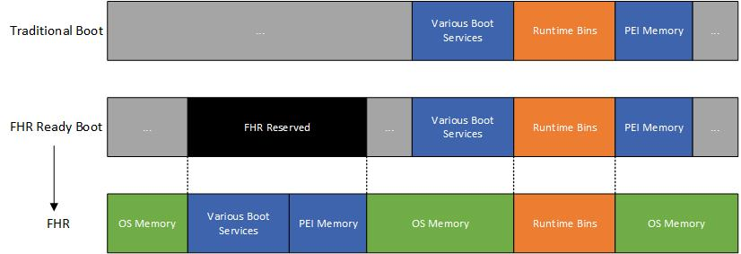
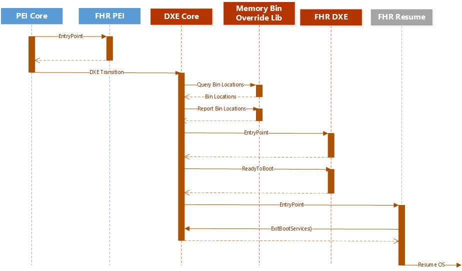

# Firmware Hot Reset Feature

Firmware Hot Reset (FHR) is a feature that allows a platform to reset the CPU
while leaving the DRAM and peripherals in a functioning state. This is primarily
to facilitate updating the firmware on a system while leaving the memory active,
allowing for a more rapid reboot as well as allowing the OS to preserve state such
as virtual machines across the reset.

## Memory Design

To support FHR, UEFI will reserve a chunk of memory that may not be reclaimed by the
OS which will be guaranteed to be available for use by UEFI during the FHR. This
region must be large enough to contain __ALL__ reclaimable UEFI memory during
boot to the BDS phase. Additionally, all runtime ranges must be consistent in
their physical address, length, and type between the traditional boot and the
FHR. The generic MU components will ensure proper usage of memory in PEI and DXE,
but requires some logic in the platform to properly initialize PEI memory as well
as handle the actual reset mechanism.

OS reclaimable memory is defined as the following types.

- EfiLoaderCode
- EfiLoaderData
- EfiBootServicesCode
- EfiBootServicesData
- EfiConventionalMemory
- EfiACPIReclaimMemory
- EfiPersistentMemory

### FHR Support Memory Model

On the traditional boot with FHR support, the memory layout will be largely
unchanged with the exception of the new FHR reserved region. This region will be
allocated by the MU components based on the _PcdFhrReservedBlockBase_ and
_PcdFhrReservedBlockLength_ PCDs. This region will only be used for storing some
firmware data during the cold boot. This FHR firmware data is used to preserve
the original memory map to reserve OS memory and ensure compliance, as well as
the location of runtime ranges that must be re-used.

On an FHR resume, all non-runtime memory must be contained to the free pages
within the FHR reserved region. This includes all boot services code/data.
Runtime memory is expected to not move from its previous allocation ranges.
Dynamically allocated runtime memory should leverage the existing memory bins,
which should be significantly over allocated, and statically allocated regions
are expected to be consistent at the platform level. All memory allocations will
be validated during resume and any consistency failure will result in a full
reboot.

### Runtime Memory

Runtime services and other runtime memory should leverage the existing bins for
restricting memory to set regions. For FHR the bins should be significantly
over-allocated and not allowed to be dynamically shrunk. The beginning and size
of the runtime bins will need to be stored across the FHR to ensure that the FHR
boot may use the same bins. Additional consideration should be made for handling
the overflow of memory from these bins. Overflowing the runtime bins will be
fatal for an FHR.

### EFI Persisted FHR Data

The first few pages of the FHR reserved region will be reserved for an FHR data block.
This block will persist information required to ensure consistency across the FHR
such as the location of the FHR bins, cold boot memory map, and any other
information or diagnostics that may be needed. This page will be set aside by the
PEIM responsible for allocating the FHR Reserved region. This block definitions
can be found in the [FHR header file](../Include/Fhr.h).

The EFI Persisted FHR data will be used to persist the following information for
an FHR.

1. The base and length of the runtime memory bins, for using the same bins on resume.
1. The final memory map of the cold boot, used for ensuring correctness.
1. A checksum of the above data to ensure integrity across the life of the system

## Boot Phase Design

To accomplish the memory layout design above the FHR feature will consist of
several platform generic modules detailed in the sections below.

### PEI

During the regular boot, PEI Core will not need any special handling of its
memory. There will be a module, FhrPei, that handles pre-allocating the FHR
reserved region but this should be separate from the initial PEI memory and so
should not need special handling in the PEI core.

During an FHR boot, the platform will be expected to do the following to
initialize the generic FHR code.

1. A platform PEIM must publish an FHR HOB indicating that this is an FHR boot
and providing relevant data such as the OS entry point and persisted UEFI data.

1. The platform PEIM must invoke _PeiInstallPeiMemory_ with memory contained in
the FHR Reserved region.

The FHR PEIM will then take the data from the FHR HOB and prepare memory for use
be PEI and DXE. This includes validated the memory layout, as well as saved FHR
structured. The PEIM will also pre-allocate or remove OS owned memory to ensure
it cannot be allocated. This memory is determined based on a stored snap-shot of
memory from the corresponding cold boot. If possible, all OS memory should not
be mapped to reduce potential for memory corruption.

PEI, and SEC if present and has memory access, often use memory without proper
accounting such as for temporary memory or FV decompression scratch. For FHR,
these regions must either be nested in FHR reserved region or should have a
runtime memory type allocation hob created. Failure to do this will likely result
in difficult to diagnose corruption.

### DXE

The DXE phase consists of two components: the memory bin override library and the
FHR DXE driver. The memory bin override library provides a mechanism for the memory
statics bins to be overwritten with their cold-boot locations on an FHR resume to
ensure that the runtime memory remains consistent. During GCD and page
initialization this library will either restore the base and range for the types
from the stored values on an FHR resume or store the range values on a cold boot.
All non-runtime bins will continue to be allocated at their usual top of memory
location, which for an FHR resume should be in the FHR reserved region.

A DXE module, FhrDxe, will handle finalization the FHR data and set up the boot
sequence for FHR to launch the FhrResume application with the BootNext option.
This module will also validate the DXE memory map against the stored value on an
FHR resume. This module will set up a callback for _ReadyToBoot_ to either capture
the memory map for a future FHR resume on cold boot or validate the correct boot
application is being launched on an FHR resume.

### BDS

During BDS on an FHR resume, the FhrResume application will be launched
as the _BootNext_ option. This application will be responsible for collecting
the final memory map, sanity checking the memory map, exiting boot services, and
jumping into the OS resume vector. During the transition, the OS provided resume
vector will have its page attribute set to RWX. The resume application is
responsible for providing any updated information required by the OS resume
vector.

## Platform Requirements

The platform will need to implement two main portions of the flow to support FHR:
The reset mechanism and proper memory initialization in PEI. There are likely to
be other requirements on the platform as a whole to ensure that the reset is
properly handled by all hardware and peripherals, but this is not detailed as
part for the core feature.

### Platform Reset

The platform is responsible for implementing the EFI *ResetSystemLib implementation
for platform specific reset type with the FHR guid to reset the CPU leaving the
memory in a preserved state. The design of how this is implemented is up to the
platform to decide. The platform must also be able to determine post-reset that
this was an FHR and retrieve the OS provided information on the other side. During
PEI the platform will be required to create the FHR hob with the OS provided
information before PEI memory is initialized. If there exists no PEI phase, then
the platform must implement the features of FHR PEI module. If this scenario
presents itself, a library could be created to assist in this.

### Memory Initialization

As on a regular boot, the platform PEI components will be responsible for
initializing memory in PEI. To ensure that memory is consistent with the associated
cold boot. Memory may not be removed, nor may the backing DIMMs have their physical
address changed. Memory may be added, but no new memory map will be given to the
OS, so the OS should already be aware of this memory if this is the case. The
initial PEI memory provided with InstallPeiMemory must be entirely contained
within the FHR reserved region, which will be defined by PCD, and must not
intersect with the first few pages reserved for the MU persisted firmware data
block as detailed above.
