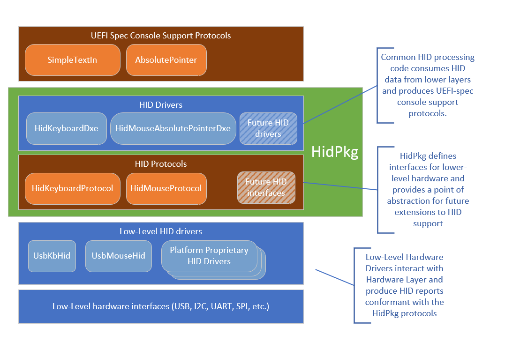

# HID support package

## Copyright

Copyright (C) Microsoft Corporation. All rights reserved.
SPDX-License-Identifier: BSD-2-Clause-Patent

## About

The purpose of this package is to provide a generic Boot HID layer that can be
used so that devices that implement the Boot Mouse and Boot Keyboard HID
interfaces defined in the USB 1.1 spec can share a common HID processing layer.

This avoids duplication of the HID parsing/processing code and provides a
natural interface layer where various HID-supporting hardware can plug into
the UEFI input stack.



Adding support for new hardware that wants to plug into HID Keyboard or Mouse
simply requires implementing HidKeyboardProtocol or HidMouseProtocol and
installing instances of those protocols on the controller handle for the
hardware.

This greatly simplifies the process of supporting hardware that is already
designed to support Boot Mouse or Boot Keyboard HID spec, since such hardware
is already producing reports in the same format that the HidKeyboardProtocol or
HidMouseProtocol expects.

## Integration Guide
To use the HidPkg, include the following drivers in your build:

FDF:
```
#HID Support
INF HidPkg/HidKeyboardDxe/HidKeyboardDxe.inf
INF HidPkg/HidMouseAbsolutePointerDxe/HidMouseAbsolutePointerDxe.inf
```

DSC:
```
#HID Support
  HidPkg/HidKeyboardDxe/HidKeyboardDxe.inf
  HidPkg/HidMouseAbsolutePointerDxe/HidMouseAbsolutePointerDxe.inf
```

Then, include low-level drivers that produce the HID protocols. This package
includes two sample drivers for USB keyboard and Mouse that can be used in place
of the standard USB keyboard and Mouse drivers. A platform may add additional
drivers to support proprietary hardware such as keyboards/track pads/
touchscreens that support the HID protocol definitions in this package.

To include the sample USB HID drivers, remove the MdeModulePkg versions and
replace them with the sample drivers from this package.

FDF:
```diff
-INF MdeModulePkg/Bus/Usb/UsbKbDxe/UsbKbDxe.inf
-INF MdeModulePkg/Bus/Usb/UsbMouseAbsolutePointerDxe/UsbMouseAbsolutePointerDxe.inf
+INF HidPkg/UsbKbHidDxe/UsbKbHidDxe.inf
+INF HidPkg/UsbMouseHidDxe/UsbMouseHidDxe.inf
```

DSC:
```diff
-  MdeModulePkg/Bus/Usb/UsbKbDxe/UsbKbDxe.inf
-  MdeModulePkg/Bus/Usb/UsbMouseAbsolutePointerDxe/UsbMouseAbsolutePointerDxe.inf
+  HidPkg/UsbKbHidDxe/UsbKbHidDxe.inf
+  HidPkg/UsbMouseHidDxe/UsbMouseHidDxe.inf
```
