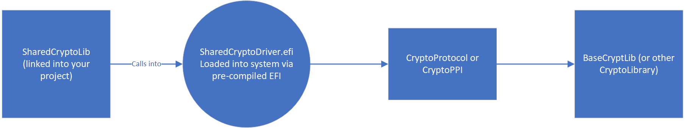

# Shared Crypto Package

## Copyright

Copyright (c) 2019, Microsoft Corporation

All rights reserved. Redistribution and use in source and binary forms, with or
without modification, are permitted provided that the following conditions are
met:
1. Redistributions of source code must retain the above copyright notice, this
   list of conditions and the following disclaimer.
2. Redistributions in binary form must reproduce the above copyright notice,
   this list of conditions and the following disclaimer in the documentation
   and/or other materials provided with the distribution.

THIS SOFTWARE IS PROVIDED BY THE COPYRIGHT HOLDERS AND CONTRIBUTORS "AS IS" AND
ANY EXPRESS OR IMPLIED WARRANTIES, INCLUDING, BUT NOT LIMITED TO, THE IMPLIED
WARRANTIES OF MERCHANTABILITY AND FITNESS FOR A PARTICULAR PURPOSE ARE DISCLAIMED.
IN NO EVENT SHALL THE COPYRIGHT HOLDER OR CONTRIBUTORS BE LIABLE FOR ANY DIRECT,
INDIRECT, INCIDENTAL, SPECIAL, EXEMPLARY, OR CONSEQUENTIAL DAMAGES (INCLUDING,
BUT NOT LIMITED TO, PROCUREMENT OF SUBSTITUTE GOODS OR SERVICES; LOSS OF USE,
DATA, OR PROFITS; OR BUSINESS INTERRUPTION) HOWEVER CAUSED AND ON ANY THEORY OF
LIABILITY, WHETHER IN CONTRACT, STRICT LIABILITY, OR TORT (INCLUDING NEGLIGENCE
OR OTHERWISE) ARISING IN ANY WAY OUT OF THE USE OF THIS SOFTWARE, EVEN IF ADVISED
OF THE POSSIBILITY OF SUCH DAMAGE.

## About

The purpose of this package is to provide a wrapper around BaseCryptLib without having to compile the underlying Crypto Library. In the past, this was a source of pain in both compile times and FV size.

The package is comprised of a Library Instance that is called SharedCryptoLib. It is contains all of the functions included by BaseCryptLib as well as a few more (mainly X509 related stuff). The library simply locates the protocol and then calls the protocol version of BaseCryptLib (SharedCryptoProtocol). It should be a drop in replacement for the BaseCryptLib. We have decided to hide the protocol headers to discourage users from directly accessing the protocol. The goal of this is to be a drop in replacement for BaseCryptLib.

The protocol is installed by several prebuilt EFI that gets downloaded via nuget. The EFI is packaged for consumption via an INF that is loaded and installed.



## Versioning

A typical version consists of 4 numbers. The year, the month of the EDK II release, the revision number, and the build number. An example of this would be _2019.03.02.01_, which would translate to EDK II 1903 release, the second revision and the first build. This means that there were two code changes within 1903 (either in BaseCryptLib or OpenSSL). Release notes will be provided on the NuGet package page and on this repo. Build numbers are reved whenever there needs to be a recompiled binary due to a mistake on our part or a build flag is tweaked.

## Flavors

Additionally there are a few different "flavors" of SharedCrypto. The three main flavors are ShaOnly, Mu, and Full. ShaOnly only supports functions related to Sha1 and Sha256 and results in a very small EFI binary. The Mu flavor is the functions that are utilized in the platforms that depend on Project Mu and what we believe are the most practical functions. The full flavor supports all functions that BaseCryptLib does. When a function is called that a flavor doesn't have, the ProtocolFunctionNotFound method from the library is called and an assert is generated.


## Reproducibility

For those wishing to verify for themselves that the packaged EFI's in the Nuget Feed match the code in this package can compile the Driver themselves by sing the SharedCryptoDriver.dsc or PublishDrivers.py. PublishDrivers is the same exact script that we run to update the package in Nuget.

## Modifying

If you wish to swap the underlying CryptoLibrary, replace the BaseCryptLib dependency in the DriverDSC with another version of BaseCryptLib that utilizes another library but conforms to the same interface.

If you wish to use a different flavor or make a new flavor, create two new INF's. One for the Binary compilation (in the /Driver folder) and one for the Binary package that is consumed by the platform (in the /Package folder). By examining existing INF's, it should be fairly trival to create new ones.

When making a new flavor please follow the convetion of SharedCryptoPkg{Phase}{Flavor}.{Target}.inf with Phase being DXE, SMM, or PEI. Target should be DEBUG or RELEASE.

## Using Different Pre-built EFI's

If you wish to use your own PreBuild EFI's, they can be placed in the /Package folder and have INF's point to them. Or the INF can be overridden fairly easily.

## Building SharedCryptoPkg

There are two pieces to be build: the library and the driver. The library is to be included in your project as BaseCryptLib.

There are 24 different versions of the prebuild driver. One for each arch (X86, AARCH64, ARM, X64) and for each phase (DXE, PEI, SMM) and for mode (DEBUG, RELEASE). The nuget system should take care of downloading the correct version for your project.

## Supported Architectures

This currently supports x86, x64, AARCH64, and ARM.

## Including in your platform

There are two ways to include this in your project: getting the protocol directly or using SharedCryptoLib. SharedCryptoLib is a wrapper that has the same API as BaseCryptLib so you can just drop it in.


## Sample DSC change

This would replace where you would normally include BaseCryptLib.

```
[LibraryClasses.X64]
    BaseCryptLib|SharedCryptoPkg/Library/CryptLibSharedDriver/DxeCryptLibSharedDriver.inf
    ...

[LibraryClasses.IA32.PEIM]
    BaseCryptLib|SharedCryptoPkg/Library/CryptLibSharedDriver/PeiCryptLibSharedDriver.inf
    ...

[LibraryClasses.DXE_SMM]
    BaseCryptLib|SharedCryptoPkg/Library/CryptLibSharedDriver/SmmCryptLibSharedDriver.inf
    ...
```

Unfortunatly, due to the way that the EDK build system works, you'll also need to include the package in your component section. Make sure this matches whatever you put in your FDF.
You'll also need to include a macro for the current TARGET.

```
[Components.IA32]
    SharedCryptoPkg/Package/SharedCryptoPkgPeiShaOnly.$(TARGET).inf
    ...

[Components.X64]
    SharedCryptoPkg/Package/SharedCryptoPkgDxeMu.$(TARGET).inf
    SharedCryptoPkg/Package/SharedCryptoPkgSmmMu.$(TARGET).inf
    ...
```

Make sure that the flavor you're using in your FDF matches the flavor you include in your DSC.

## Sample FDF change

Include this file in your FV and the module will get loaded. In this example, we are looking at the Mu flavor for DXE and the ShaOnly flavor for PEI, but feel free to swap it out with whatever flavor(s) you are using on your platform.

```
[FV.FVBOOTBLOCK]
    INF  SharedCryptoPkg/Package/SharedCryptoPkgPeiShaOnly.$(TARGET).inf
    ...

[FV.FVDXE]
    INF  SharedCryptoPkg/Package/SharedCryptoPkgDxeMu.$(TARGET).inf
    INF  SharedCryptoPkg/Package/SharedCryptoPkgSmmMu.$(TARGET).inf
    ...
```
