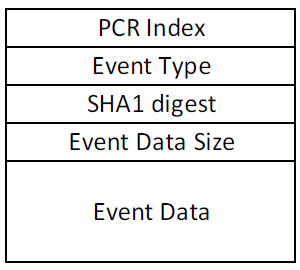
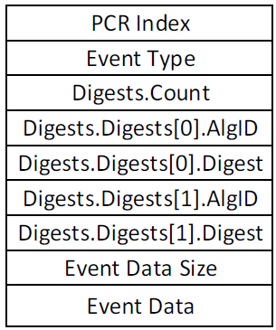

# TPM Replay

This feature provides the ability to replay TPM measurements from a custom-made event log. The primary purpose is for
testing operating system features dependent on measurements.

## Overview

The [Trusted Platform Module (TPM)](https://learn.microsoft.com/en-us/windows/security/information-protection/tpm/trusted-platform-module-overview)
is a secure crypto-processor that provides important security-related functionality. While this includes a number of
useful capabilities, this firmware feature focuses on testing boot measurements made to the TPM often used for device
attestation and other [high-level security-sensitive operating system features](https://learn.microsoft.com/en-us/windows/security/information-protection/tpm/how-windows-uses-the-tpm).
The goal is to simplify OS testing of features dependent on TPM measurements, by allowing an exact sequence of
measurements to be specified that will be replayed during firmware boot.

## PCRs

TPMs contain memory locations called Platform Configuration Registers (PCRs). Each PCR contains the hash for a type of
code and/or data loaded during the boot such as firmware code on the non-volatile storage device (for example, SPI
flash), option ROMs from PCI devices, or the OS boot loader. The size of a value that can be stored in a PCR is
determined by the digest size of the hashing algorithm supported. For example, a SHA-1 PCR can store 20 bytes while a
SHA-2 PCR can store 32 bytes. Multiple PCRs associated with the same hashing algorithm are called a bank. The
[TCG PC Client TPM Profile Specification](https://trustedcomputinggroup.org/resource/pc-client-platform-tpm-profile-ptp-specification/)
defines the inclusion of at least one PCR bank with 24 registers (i.e. 24 PCRs).

Per the [TCG PC Client Platform Firmware Profile Specification](https://trustedcomputinggroup.org/resource/pc-client-specific-platform-firmware-profile-specification/),
PCRs contain measurements for different types of data or code. PCRs [0-15] represent S-RTM content. PCRs [0-7] are used
for platform firmware, PCRs [8-15] are used for the operating system, and PCRs [16-23] are used for debug, D-RTM, and
applications. Since this is a firmware feature, only extending PCRs [0-7] are in scope.

Normally when a TPM is present, firmware components will update or extend the appropriate PCR as new code and data is
loaded in the boot process. The extend process updates the PCR value to be the output from the hash algorithm using
the current PCR value concatenated with the new code or data argument as input.

```txt
  PCR_NEW = HASH (PCR_OLD || HASH (Data))
```

The result is that PCRs can be inspected after the boot process to determine what executed. The extend operation is the
only method to modify a PCR value during boot This allows software in the operating system to understand if the boot
process was different than previous boots. In a security sensitive environment, the operating system can be informed of
the exact set of code measurements expected in certain PCRs to detect the execution of unexpected firmware code. Since
the first 16 PCRs in a bank can only be reset by resetting the entire TPM, they are trusted, and the preferred location
for storing important measurements in the TPM.

PCRs enable the TPM to serve as a Root of Trust for Storage (RTS) and Root of Trust for Reporting (RTR) while the host
firmware acts as a Static Root of Trust for Measurement (S-RTM).

## TCG Event Log

The event log is the information record of measurements made to PCRs by platform firmware. Every measurement made will
be reflected in the event log in addition to some informational events that do not extend PCRs.

To simplify how to structure and manage measurement data, this feature accepts the measurements to replay in the form
of `TCG_PCR_EVENT2` structures. An exception is that the first event in the log may be a `TCG_PCClientPCREvent`
structure which typically represents the `Specification ID Version Event` for backward compatibility with non-TPM 2.0
aware parsers.

`[Optional] Structure: TCG_PCClientPCREvent`



| **Name**         | **Type**               | **Size** | **Offset** | **Description**                                  |
|------------------|------------------------|----------|------------|--------------------------------------------------|
| pcrIndex         | `UINT32`               | 4        | 0          | The index of the PCR register.                   |
| eventType        | `UINT32`               | 4        | 4          | Must be an `EV_NO_ACTION` event.                 |
| digest           | `BYTE[20]`             | 20       | 8          | Must be 20 bytes of `0x00`.                      |
| eventDataSize    | `UINT32`               | 4        | 28         | The size of the event in bytes.                  |
| event            | `BYTE[eventDataSize]`  | Variable | 32         | Must be a `TCG_EfiSpecIdEvent` data structure.   |

`Structure: TCG_PCR_EVENT2`



| **Name**         | **Type**               | **Size** | **Offset** | **Description**                                            |
|------------------|------------------------|----------|------------|------------------------------------------------------------|
| pcrIndex         | `UINT32`               | 4        | 0          | The index of the PCR register.                             |
| eventType        | `UINT32`               | 4        | 4          | The type of event.                                         |
| digests          | `TPML_DIGEST_VALUES`   | Variable | Variable   | A counted list of tagged digests for all active PCR banks. |
| eventSize        | `UINT32`               | 4        | Variable   | The size of the event data in bytes.                       |
| event            | `BYTE[eventSize]`      | Variable | Variable   | The event data.                                            |

`Structure: TPML_DIGEST_VALUES`

| **Name**         | **Type**         | **Description**                                  |
|------------------|------------------|--------------------------------------------------|
| count            | `UINT32`         | Number of digests in the `digests` array.        |
| digests          | `TPMT_HA[]`      | Array of hash digest structures.                 |

`Structure: TPMT_HA`

| **Name**         | **Type**         | **Description**                                  |
|------------------|------------------|--------------------------------------------------|
| algId            | `UINT16`         | Selector of the hash contained in `digest`.      |
| digest           | `BYTE[]`         | Digest. Size depends on `algId`.                 |

Note that integers are stored in the event log in little-endian and that the `TPM2_PCR_EVENT` and `TPM_PCR_Extend`
commands operate on big-endian integer values. For example, a `TPML_DIGEST_VALUES` structure returned from
`TPM2_PCR_Event` would be encoded in big-endian and, in particular, the `count` and `AlgID` fields would need to be
converted to little-endian before being added to the event log.

### TPM Replay Event Log Format

The actual format consumed by this feature is documented below. Note that the TCG Event Log information described above
is a subset of the complete TPM Replay Event Log structure.

| **Name**          | **Type**      | **Size** | **Offset** | **Description**                                               |
|-------------------|---------------|----------|------------|---------------------------------------------------------------|
| Signature         | `UINT64`      | 4        | 0          | The structure signature - `_TPMRPL_`.                         |
| Revision          | `UINT32`      | 4        | 4          | The structure revision.                                       |
| Timestamp         | `EFI_TIME`    | 16       | 8          | A timestamp of the time the contained event log was produced. |
| StructureSize     | `UINT32`      | 4        | 24         | The size of the total payload (including event data) in bytes.|
| FinalPcrCount     | `UINT32`      | 4        | 28         | The number of PCRs in the `FinalPcrs` array.                  |
| OffsetToFinalPcrs | `UINT32`      | 4        | 32         | The offset, in bytes, to the `FinalPcrs` array.               |
| EventLogCount     | `UINT32`      | 4        | 36         | The number of entries in the `EventLog` array.                |
| OffsetToEventLog  | `UINT32`      | 4        | 40         | The offset, in bytes, to the `EventLog` array.                |

> `Timestamp` is only used for informational purposes at this time and the value does not matter to the TPM replay
> event log feature.

`Revision` field details:

- Considering the mask: `0xAAAABBCC`
  - For now, `AAAA` should be considered reserved, but may eventually encode non-structural
    information such as signature type or signature digest size.
  - `BB` is the major structure number.
  - `CC` is the minor structure number.
- Any change to the structure that would still be parseable by existing code (e.g. adding new fields at the end)
  should result in an update to the minor number.
- Any change that would break backwards compatibility with older parsing code (e.g. removing the `FinalPcrs` field
  and all related fields) should result in an update to the major number.

The following fields immediately proceed the above header structure and are of variable size.

| **Name**         | **Type**                             | **Size** | **Offset** | **Description**                            |
|------------------|--------------------------------------|----------|------------|--------------------------------------------|
| FinalPcrs        | `CALCULATED_PCR_STATE[FinalPcrCount]`| Variable | 0          | An array of the final PCR value expected.  |
| EventLog         | `TCG_PCR_EVENT2[EventLogCount]`      | Variable | Variable   | The event data.                            |

> `FinalPcrs` is optional. If not used, `FinalPcrCount` and `OffsetToFinalPcrs` should both be set to `0` and the
> structure should not be present. If these conditions, are not met, validation errors will be raised accordingly.

Where `CALCULATED_PCR_STATE` is defined as follows:

| **Name**         | **Type**             | **Size** | **Offset** | **Description**                             |
|------------------|----------------------|----------|------------|---------------------------------------------|
| PcrIndex         | `UINT32`             | 4        | 0          | The PCR index.                              |
| Digests          | `TPML_DIGEST_VALUES` | Variable | Variable   | A count and array of digests.               |

## TCG PCRs Supported

As previously noted, only PCRs [0-7] are within the scope of this feature. In order to cleanly replay a given sequence
of measurements, both the event type must be understood by this feature and the host firmware must be configured to
prevent its own measurements that would interfere with the final event log on the system.

At this time, the following PCRs are supported:

- `0`: S-RTM, Host Firmware, Embedded Option ROMs, etc.
- `1`: Host platform configuration
- `2`: UEFI driver and application code
- `3`: UEFI driver and application configuration data
- `4`: UEFI Boot Manager code and Boot Attempts
- `5`: Boot manager code and configuration data (for use by a boot manager)
- `6`: Host-platform manufacturer specific (often unused)
- `7`: Secure Boot Policy and Secure Boot Verification Authority

If a given replay log contains unsupported PCR or event type, a warning will be displayed noting that it was skipped.
A warning is chosen over a hard error to reduce log preparation time needed to use the replay feature.

## Locality Restriction

Locality is a hardware addressing mechanism used to establish a trusted path between user and a TPM. By restricting
the addresses accessible to hardware components, locality can provide proof of the initiating (i.e. source)
component's identity. Because locality is dependent on addressing hardware to segregate the TPM communication channel,
it's support varies across virtual and physical platforms.

For example, [QEMU only supports Locality 0](https://qemu.readthedocs.io/en/latest/specs/tpm.html#crb-interface) on its
CRB interface.

Due to varying levels of platform support, this feature currently only supports the default locality, Locality 0
(`0xFED4_0XXX`) which is typically used by the platform boot firmware (where TPM Replay is located). A `StartupLocality`
event will appear in the TCG event log but not impact the actual PCRs on a platform.

## TCG Event Log Input Channels

There's currently three ways to supply a replay event log:

1. UEFI Variable
2. QEMU Firmware Configuration Device (`fw_cfg`)
3. RAW file included in the firmware build

For all the input channels available, the TPM replay event log data must match the structure described in section
[TPM Replay Event Log Format](#tpm-replay-event-log-format).

### TCG Event Log Input Channel Order of Precedence

Only one channel may be used at a time. The following descending order of precedence is used for the channels
currently defined:

1. UEFI variable
2. QEMU Firmware Configuration Device (`fw_cfg`)
3. `RAW` file included in the firmware build

For example, if a `RAW` file is included in the firmware, it will be used by default. If a UEFI variable is set, the
TPM replay event log in the variable will be used instead of the `RAW` file until the variable is removed.

### Input Channel: UEFI Variable

UEFI variables associate data (the TPM replay event log in this case) with a GUID/name pair. The UEFI variable can be
created, modified, and deleted per the UEFI Specification.

- **Input Environment:**
  - EFI Shell or OS Running the Firmware with TPM Replay.
- **Requirements:**
  - Platform support for non-volatile UEFI variables.
- **Maximum Size:**
  - Platform Dependent. Assume 32KB.
- **User Flow:**
  - Boot to EFI shell or OS and set the `TpmReplayEventLog` UEFI variable
  - Reset the system
  - All future boots will replay the values in the UEFI variable until it is deleted

#### Variable Information

- Name: `TpmReplayEventLog`
- Vendor GUID: `{C6D186FF-D248-48F3-BB9A-D91103BBDD63}`

### Input Channel: `fw_cfg`

The Firmware Configuration (`fw_cfg`) device is a hardware interface available on [QEMU](https://www.qemu.org/) that
allows the guest firmware to retrieve various data items. The plan is to use this interface to allow the TPM replay
event log to be passed from the host when it instantiates the QEMU session.

- **Input Environment:**
  - Host OS on command line when launching QEMU.
- **Requirements:**
  - QEMU v5.1+
  - Linux host (to support QEMU TPM backends)
  - A TPM backend (passthrough or `swtpm`)
    - Note: This feature has only been tested with [`swtpm`](https://qemu.readthedocs.io/en/latest/specs/tpm.html#the-qemu-tpm-emulator-device)
- **Maximum Size:**
  - The firmware will accept up to 1MB of data.
- **User Flow:**
  - Update the QEMU parameters per the examples below to point to a file or a full event log string
  - Launch the system
    - The launch will immediately replay the values passed on the command-line.

#### QEMU Command-Line Information: TPM Replay Event Log file

A file containing the TCG replay event log can be passed as a command line parameter:

```shell
-fw_cfg [name=]<item_name>,file=<path>
```

A string containing the TCG replay event log can be passed as a command line parameter:

```shell
-fw_cfg [name=]<item_name>,string=<string>
```

The `<item_name>` is `opt/org.mu/tpm_replay/event_log`.

#### QEMU Command-Line Information: `swtpm` Enabling

The following command will enable `swtpm` and save a log with TPM interactions to a file called `tpm.log`.

```shell
    "swtpm",
    "socket",
    "--tpmstate", "dir=/tmp/mytpm1/tpm",
    "--ctrl", "type=unixio,path=/tmp/mytpm1/swtpm-sock",
    "--tpm2",
    "--log", "file=/tmp/mytpm1/tpm/tpm.log,level=20"]
```

### Input Channel: RAW Firmware File

A `RAW` file is mostly targeted at firmware developer scenarios as it requires the firmware to be built with the TPM
replay event log included.

The first RAW section found in the FFS file with the specified GUID will be used as the TPM replay event log.

- **Input Environment:**
  - Source code during firmware build.
- **Requirements:**
  - Source access and ability to build UEFI firmware.
- **Maximum Size:**
  - The firmware will accept up to 1MB of data.
- **User Flow:**
  - Update the platform firmware FDF file to include the FFS file with a `RAW` section containing the TPM replay
    event log.
  - Flash the firmware on the system.
  - The boot will replay the entries from the log in the `RAW` file.

#### Adding the Event Log to the Firmware

The FFS file GUID must be: `{C6D186FF-D248-48F3-BB9A-D91103BBDD63}`.

Here's an example of how to adjust the log used in the platform FDF file:

```ini
  FILE FREEFORM = C6D186FF-D248-48F3-BB9A-D91103BBDD63 {
    SECTION RAW = Path/TpmReplayEventLog.bin
  }
```

### TPM Replay Event Log Tool

A cross-platform Python tool is provided to construct TPM replay event logs. The tool supports the following
capabilities:

- Creation of the binary file needed by firmware for TPM replay from a JSON or YAML file that describes the
  measurements to perform.
- Creation of a YAML file from a given binary that describes the measurements in the binary event log.
- Generation of a text report detailing the measurements in a given binary or YAML file (i.e. `-l` and `-v` options).
- Breakdown of UEFI variable data in events that represent UEFI variables.
- Decoding of "crypto agile event logs" as described in the TCG PC Client Platform Firmware Profile Specification.
  This includes the log produced by Windows (usually present in the `C:\Windows\Logs\MeasuredBoot` directory).
